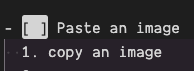

# Use Keyboard Shortcuts for Editing

Here are some keyboard shortcuts you'll love when editing your notes.

This works best if you can see the result in the preview panel, run the `Markdown: Open Preview to the Side` command.

- [x] `alt+c` changes state to a TODO item. Try it while the cursor is on this line.

---

- [x] `cmd+b` makes the selection bold. Select me and make me bold.

---

- [x] `cmd+i` makes the selection italic. Select me and make me italic.

---

- [x] `alt+shift+f` formats a table. Place the cursor in the table below and format the table.

| column 1    | column 2        |
| ----------- | --------------- |
| one element | another element |
| second row  | last cell       |

---

- [x] Paste link on selected text
  1. copy the following text: https://google.com
  2. [select me and paste](https://google.com)

---

- [x] Search in your repo with `cmd+shift+f`: type "search"
  - (go back to the file explorer with `cmd+shift+e`)

---

- [x] Paste an image
  1. copy an image
  2. move your cursor to the next line, then press `cmd+alt+v` and confirm the name of the file
  3. .
  4. the image file has been created in `/attachments` and a reference to it has been added here
